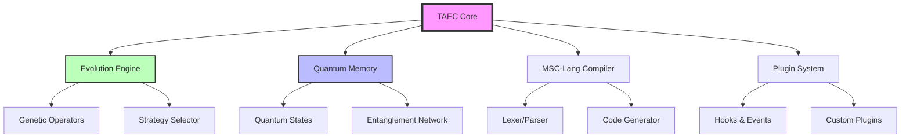

# TAEC Advanced Module v3.0 🧠✨
### Sistema de Auto-Evolución Cognitiva con Computación Cuántica

<div align="center">
  


[**Instalación**](#-instalación) • [**Uso Rápido**](#-uso-rápido) • [**Documentación**](#-documentación) • [**Contribuir**](#-contribuir)

</div>

---

## 🌟 Características Principales

<table>
<tr>
<td width="50%">

### 🚀 Evolución Inteligente
- **Motor de evolución adaptativo** con múltiples estrategias
- **Optimización automática** de código y estructuras
- **Aprendizaje continuo** mediante algoritmos genéticos

</td>
<td width="50%">

### 🔬 Computación Cuántica
- **Memoria cuántica** con corrección de errores
- **Estados entrelazados** y superposición
- **Algoritmos cuánticos** (Grover, QAOA, VQE)

</td>
</tr>
<tr>
<td width="50%">

### 🧩 Lenguaje MSC-Lang 2.0
- **Sintaxis expresiva** para síntesis cognitiva
- **Pattern matching** y categorías
- **Compilador JIT** optimizado

</td>
<td width="50%">

### 📊 Análisis y Métricas
- **Detección de emergencia** en tiempo real
- **Visualizaciones interactivas** del sistema
- **Métricas de rendimiento** detalladas

</td>
</tr>
</table>

## 🏗️ Arquitectura



## 💻 Instalación

### Requisitos Previos
- Python 3.8 o superior
- Git
- Docker (opcional)

### Instalación Estándar

```bash
# Clonar el repositorio
git clone https://github.com/yourusername/taec-v3.git
cd taec-v3

# Crear entorno virtual
python -m venv venv
source venv/bin/activate  # En Windows: venv\Scripts\activate

# Instalar dependencias
pip install -r requirements.txt
```

### 🐳 Instalación con Docker

```bash
# Construir imagen
docker build -t taec-v3:latest .

# Ejecutar contenedor
docker run -it -p 8000:8000 -v $(pwd)/data:/app/data taec-v3:latest
```

## 🚀 Uso Rápido

### Ejemplo Básico

```python
from taec_v3 import TAECAdvancedModule

# Configuración
config = {
    'quantum_dimensions': 4,
    'auto_save': True,
    'max_evolution_time': 300
}

# Crear instancia
taec = TAECAdvancedModule(graph, config)

# Ejecutar evolución
result = await taec.evolve_system()
print(f"Score: {result['overall_score']:.3f}")
```

### Compilar Código MSC-Lang

```python
# Código MSC-Lang
mscl_code = """
synth quantum_synthesis {
    quantum dimensions = 8;
    nodes = graph.get_high_value_nodes();
    
    monad StateMonad = quantum_state(dimensions);
    
    superposition = StateMonad >>= lambda state: {
        for i, node in enumerate(nodes) {
            state[i] = node.state * exp(1j * node.phase);
        }
        return normalize(state);
    };
    
    quantum_memory.store("synthesis_result", superposition);
}
"""

# Compilar y ejecutar
compiled, errors, warnings = taec.compile_mscl_code(mscl_code)
result = await taec.execute_mscl_code(mscl_code)
```

## 📚 Documentación

### MSC-Lang 2.0

MSC-Lang es un lenguaje diseñado específicamente para la síntesis cognitiva y evolución de sistemas.

#### Características del Lenguaje

- **Síntesis Cognitiva**: `synth`, `node`, `flow`
- **Evolución**: `evolve`, `merge`, `spawn`
- **Cuántica**: `quantum`, `monad`, `entangle`
- **Pattern Matching**: `match`, `case`
- **Categorías**: `category`, `functor`, `monad`

#### Ejemplo Completo

```mscl
# Detectar patrones emergentes
pattern EmergenceDetector {
    nodes: List[Node];
    threshold: float = 0.7;
}

function detect_emergence(graph) {
    patterns = [];
    
    for cluster in graph.get_clusters() {
        density = calculate_density(cluster);
        coherence = calculate_coherence(cluster);
        
        if density > 0.6 and coherence > threshold {
            pattern = EmergenceDetector {
                nodes => cluster.nodes,
                threshold => coherence
            };
            patterns.append(pattern);
        }
    }
    
    return patterns;
}

# Evolución adaptativa
class AdaptiveEvolution {
    async function evolve(population) {
        # Evaluar fitness
        fitness_scores = [evaluate(ind) for ind in population];
        
        # Selección y reproducción
        new_population = [];
        
        # Elite
        elite = select_best(population, fitness_scores, n=5);
        new_population.extend(elite);
        
        # Crossover y mutación
        while len(new_population) < len(population) {
            parent1 = tournament_select(population);
            parent2 = tournament_select(population);
            
            child = crossover(parent1, parent2);
            
            if random() < 0.15 {
                child = mutate(child);
            }
            
            new_population.append(child);
        }
        
        return new_population;
    }
}
```

### API Reference

#### TAECAdvancedModule

```python
class TAECAdvancedModule:
    def __init__(self, graph, config: Optional[Dict[str, Any]] = None)
    
    async def evolve_system(self, **kwargs) -> Dict[str, Any]
    """Ejecuta un ciclo completo de evolución"""
    
    def compile_mscl_code(self, source: str) -> Tuple[Optional[str], List[str], List[str]]
    """Compila código MSC-Lang a Python"""
    
    async def execute_mscl_code(self, source: str) -> Dict[str, Any]
    """Compila y ejecuta código MSC-Lang"""
    
    def get_memory_stats(self) -> Dict[str, Any]
    """Obtiene estadísticas de memoria cuántica"""
    
    def get_performance_stats(self) -> Dict[str, Any]
    """Obtiene métricas de rendimiento"""
    
    def get_visualization(self, viz_type: str = 'memory') -> Optional[Any]
    """Genera visualización del sistema"""
```

## 🔧 Configuración

### Parámetros de Configuración

```python
config = {
    # Quantum
    'quantum_dimensions': 4,          # Dimensiones del espacio cuántico
    'decoherence_rate': 0.01,        # Tasa de decoherencia
    
    # Evolution
    'max_evolution_time': 300,        # Tiempo máximo por evolución (s)
    'population_size': 50,            # Tamaño de población genética
    'mutation_rate': 0.15,            # Tasa de mutación base
    
    # System
    'auto_save': True,                # Guardado automático
    'autosave_dir': 'taec_saves',     # Directorio de guardado
    'max_autosaves': 10,              # Máximo de archivos guardados
    
    # Compilation
    'optimize_mscl': True,            # Optimizar código compilado
    'debug_mscl': False,              # Debug del compilador
    'execution_timeout': 30,          # Timeout de ejecución (s)
    
    # Plugins
    'plugin_dir': 'taec_plugins',     # Directorio de plugins
    
    # Memory
    'memory_persistence_path': None,  # Path para persistencia
    'code_repository_size': 1000,     # Tamaño del repositorio
    'history_size': 10000            # Tamaño del historial
}
```

## 🔌 Sistema de Plugins

### Crear un Plugin

```python
from taec_v3 import TAECPlugin

class MyCustomPlugin(TAECPlugin):
    def initialize(self, taec_module):
        """Inicializa el plugin"""
        print(f"Plugin initialized with TAEC v{taec_module.version}")
        
        # Registrar hooks
        taec_module.plugin_manager.register_hook(
            'evolution_complete', 
            self.on_evolution_complete
        )
    
    def get_name(self) -> str:
        return "MyCustomPlugin"
    
    def get_version(self) -> str:
        return "1.0.0"
    
    async def on_evolution_complete(self, evolution_id, results):
        """Callback cuando completa una evolución"""
        score = results.get('overall_score', 0)
        print(f"Evolution {evolution_id} completed: {score:.3f}")

# Registrar plugin
taec.register_plugin(MyCustomPlugin())
```

## 📊 Visualizaciones

TAEC v3 incluye visualizaciones interactivas del sistema:

### Tipos de Visualización

1. **Memory Visualization** (`'memory'`)
   - Estado de celdas cuánticas
   - Red de entrelazamiento
   - Uso de memoria por contexto
   - Métricas de rendimiento

2. **Evolution Visualization** (`'evolution'`)
   - Progreso del fitness
   - Distribución de estrategias
   - Tasas de éxito
   - Evolución de métricas clave

3. **Graph Visualization** (`'graph'`)
   - Topología del grafo
   - Estados de nodos
   - Conexiones y pesos
   - Nodos importantes

### Generar Visualizaciones

```python
# Generar visualización de memoria
memory_fig = taec.get_visualization('memory')
memory_fig.savefig('memory_viz.png', dpi=150)

# Generar todas las visualizaciones
for viz_type in ['memory', 'evolution', 'graph']:
    fig = taec.get_visualization(viz_type)
    if fig:
        fig.savefig(f'taec_{viz_type}.png', dpi=150)
```

## 🧪 Testing

```bash
# Ejecutar tests unitarios
pytest tests/

# Con coverage
pytest --cov=taec_v3 tests/

# Tests específicos
pytest tests/test_evolution.py -v
```

## 🚀 Despliegue

### Producción con Docker

```bash
# Construir imagen de producción
docker build -f Dockerfile.prod -t taec-v3:prod .

# Ejecutar con docker-compose
docker-compose up -d

# Escalar servicios
docker-compose scale taec-worker=3
```

### Kubernetes

```yaml
apiVersion: apps/v1
kind: Deployment
metadata:
  name: taec-v3
spec:
  replicas: 3
  selector:
    matchLabels:
      app: taec-v3
  template:
    metadata:
      labels:
        app: taec-v3
    spec:
      containers:
      - name: taec
        image: taec-v3:latest
        resources:
          requests:
            memory: "1Gi"
            cpu: "500m"
          limits:
            memory: "2Gi"
            cpu: "1"
```

## 🤝 Contribuir

¡Las contribuciones son bienvenidas! Por favor, lee nuestras [guías de contribución](CONTRIBUTING.md).

### Proceso de Contribución

1. Fork el repositorio
2. Crea una rama para tu feature (`git checkout -b feature/AmazingFeature`)
3. Commit tus cambios (`git commit -m 'Add some AmazingFeature'`)
4. Push a la rama (`git push origin feature/AmazingFeature`)
5. Abre un Pull Request

## 📄 Licencia

Este proyecto está licenciado bajo la **Business Source License 1.1 (BSL 1.1)**.

### ⚠️ Importante sobre la Licencia

- **Uso No Comercial**: El uso está permitido para investigación, experimentación personal, aprendizaje y evaluación.
- **Uso Comercial**: **PROHIBIDO** sin autorización explícita por escrito de esraderey.
- **Fecha de Cambio**: 30 de julio de 2030, después de la cual el software se convierte en Apache License 2.0.

Para obtener una licencia comercial o más detalles, consulte el archivo [LICENSE](LICENSE) o contacte a esraderey.

```
Copyright (c) 2025 esraderey

Este software está licenciado bajo la Business Source License 1.1
Parámetros de Uso: Ver LICENSE en el repositorio raíz
Fecha de Cambio: 2030-07-30
Licencia de Cambio: Apache License, Version 2.0

AVISO IMPORTANTE: Todo uso comercial requiere autorización explícita previa.
```

## 🙏 Agradecimientos

- Equipo de desarrollo de TAEC
- Comunidad de computación cuántica
- Contribuidores del proyecto

---

<div align="center">
  
**[⬆ Volver arriba](#taec-advanced-module-v30-)**

Hecho con ❤️ por el equipo TAEC

</div>
